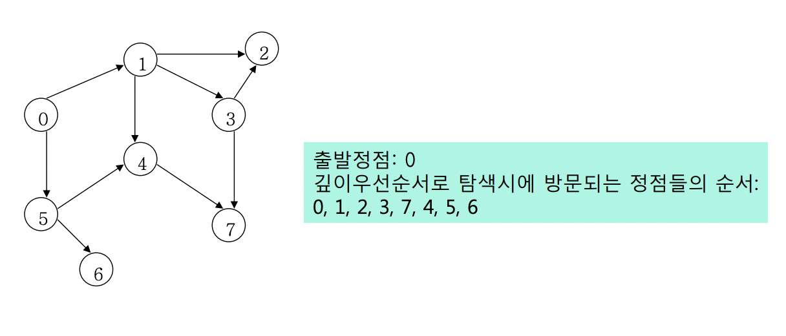

## Algorithm 목차

---

- [Algorithm 목차](#algorithm-목차)
  - [**DFS(깊이 우선 탐색)**](#dfs깊이-우선-탐색)
    - [**동작 원리**](#동작-원리)
    - [시간 복잡도](#시간-복잡도)
    - [코드 구현](#코드-구현)
  - [BFS(너비 우선 탐색)](#bfs너비-우선-탐색)

</br>
</br>
</br>

### **DFS(깊이 우선 탐색)**

---

</br>

- 그래프를 `깊이`, 종의 방향 각 정점을 한 번만 방문하는완전 탐색.
- `재귀`, `stack` 구현 방식
- 재귀 호출 시 스택 메모리에 쌓임, 이론 상 동일한 원리

</br>

#### **동작 원리**

</br>

> 1. 시작 정점 시작.
> 2. 현재 방문 정점 v와 인접한 정점을 하나씩 검사.
> 3. 장문 되지 않은 정점 w가 있으면 방문 반복 후
> 4. 더 이상 갈 곳이 없는 정점에 도달하면 이전 간선을 따라 backtrack
> 5. 다시 인접한 정점을 방문 탐색 반복

</br>
</br>

#### 시간 복잡도

|  구현 방식  | 수행 시간 |
| :---------: | :-------: |
|  인접 행렬  |  O(n^n)   |
| 인접 리스트 |  O(n+m)   |

- n : 정점의 개수
- m : 에지의 개수

1. 인접 행렬

> 인접 하는 간선을 모두 검사하는 방식으로 2차원 행렬을 통해 에지 정보를 모두 검색함으로 O(n^n)이다.

</br>

1. 인접 리스트

> 각 정점 n개의 리스트가 가지고 있는 m의 정보임으로 O(n+m)이다.

</br>
</br>

#### 코드 구현



> 예시 그림대로 0에서 부터 출발 하여 각각 인접행렬과 인접리스트로 구현 후  
> 시작 지점과 도착 지점 간의 최소 거리를 출력 해보기.

</br>

- 인접 행렬

</br>

```java
public static void dfsByMatrix(int adjMatrix[][], boolean[] visited, int start, int end,int distance){
        //인접행렬 구현
        visited[start] = true;
        path += start;


        if(start == end){ // 탐색 성공
            if(shortestDistance == -1) // 첫 번째 탐색일 경우 갱신
                shortestDistance = distance;
            else
                /* 첫 번째 탐색이 아닐 경우
                 * 1) 현재 최단 거리가 distance보다 크면 최단 거리 갱신
                 * 2) 현재 최단 거리가 distance보다 작으면 현재 최단 거리 유지.
                 */
                shortestDistance = shortestDistance > distance ? distance : shortestDistance;
            return;

        }


        for(int w = 0; w<adjMatrix.length; w++){
            if(adjMatrix[start][w] == 1 && !visited[w]){
                dfsByMatrix(adjMatrix,visited,w,end,distance+1);
            }
        }
        return; // 탐색 불가
    }
```

</br>

- 인접 리스트

```java
public static void dfsByList(ArrayList<Integer>[] arrayLists, boolean[] visited, int start, int end, int distance){
        //인접 리스트 구현
        visited[start] = true;
        path+=start;

        if(start == end){ // 탐색 성공
            if(shortestDistance == -1) // 첫 번째 탐색일 경우 갱신
                shortestDistance = distance;
            else
                /* 첫 번째 탐색이 아닐 경우
                 * 1) 현재 최단 거리가 distance보다 크면 최단 거리 갱신
                 * 2) 현재 최단 거리가 distance보다 작으면 현재 최단 거리 유지.
                 */
                shortestDistance = shortestDistance > distance ? distance : shortestDistance;
            return;
        }

        for (int w : arrayLists[start]) {
            if(!visited[w])
                dfsByList(arrayLists, visited, w, end, distance+1);
        }

        return; //탐색 불가
    }
```

> - 두 방식 모두 재귀를 통해 구현 했기 때문에 항상 탈출 조건에 유의.

</br>
</br>
</br>

- 전체 코드 및 테스트

```java

import java.util.ArrayList;
import java.util.Scanner;

/*input example
* n m (8, 10)
* 0 1
* 1 2
* 1 3
* 3 2
* 1 4
* 4 7
* 3 7
* 0 5
* 5 4
* 5 6
* */

public class DFS {
    private static int shortestDistance=-1; // 탐색 불가.
    private static String path ="";

    public static void main(String[] args) {
        Scanner sc = new Scanner(System.in);

        int n = sc.nextInt(); // 정점의 개수
        int m = sc.nextInt(); // 에지의 개수

        int[][] adjMatrix = new int[n][n];// 인접행렬 0으로 초기화
        ArrayList<Integer>[] adjList = (ArrayList<Integer>[])new ArrayList[n];
        for (int i = 0; i < n; i++) {
            adjList[i] = new ArrayList<>();
        }

        for (int i = 0; i < m; i++) {
            int v1 = sc.nextInt();
            int v2 = sc.nextInt();

            adjMatrix[v1][v2] = 1;
//in case of undirected graph adjMatrix[v2][v1] = 1;
            adjList[v1].add(v2);
//in case of undirected graph list[v2].add(v1);
        }

        boolean[] visited = new boolean[n];

        for (int i = 0; i < n; i++) {
            visited[i] = false; // 미방문 초기화
        }

        dfsByList(adjList,visited,0,7,0);
        System.out.println(path);
        System.out.println(shortestDistance);
    }

    public static void dfsByMatrix(int adjMatrix[][], boolean[] visited, int start, int end,int distance){
        //인접행렬 구현
        visited[start] = true;
        path += start;


        if(start == end){ // 탐색 성공
            if(shortestDistance == -1) // 첫 번째 탐색일 경우 갱신
                shortestDistance = distance;
            else
                /* 첫 번째 탐색이 아닐 경우
                 * 1) 현재 최단 거리가 distance보다 크면 최단 거리 갱신
                 * 2) 현재 최단 거리가 distance보다 작으면 현재 최단 거리 유지.
                 */
                shortestDistance = shortestDistance > distance ? distance : shortestDistance;
            return;

        }


        for(int w = 0; w<adjMatrix.length; w++){
            if(adjMatrix[start][w] == 1 && !visited[w]){
                dfsByMatrix(adjMatrix,visited,w,end,distance+1);
            }
        }
        return; // 탐색 불가
    }

    public static void dfsByList(ArrayList<Integer>[] arrayLists, boolean[] visited, int start, int end, int distance){
        //인접 리스트 구현
        visited[start] = true;
        path+=start;

        if(start == end){ // 탐색 성공
            if(shortestDistance == -1) // 첫 번째 탐색일 경우 갱신
                shortestDistance = distance;
            else
                /* 첫 번째 탐색이 아닐 경우
                 * 1) 현재 최단 거리가 distance보다 크면 최단 거리 갱신
                 * 2) 현재 최단 거리가 distance보다 작으면 현재 최단 거리 유지.
                 */
                shortestDistance = shortestDistance > distance ? distance : shortestDistance;
            return;
        }

        for (int w : arrayLists[start]) {
            if(!visited[w])
                dfsByList(arrayLists, visited, w, end, distance+1);
        }

        return; //탐색 불가
    }
}
```


예시 이미지와 동일한 정보를 입력.
시작 노드는 0, 도착 노드는 7로 테스트 한 결과

[To 목차](#algorithm-목차)

</br>

### BFS(너비 우선 탐색)

---

</br>
</br>
</br>

[To 목차](#algorithm-목차)

</br>
