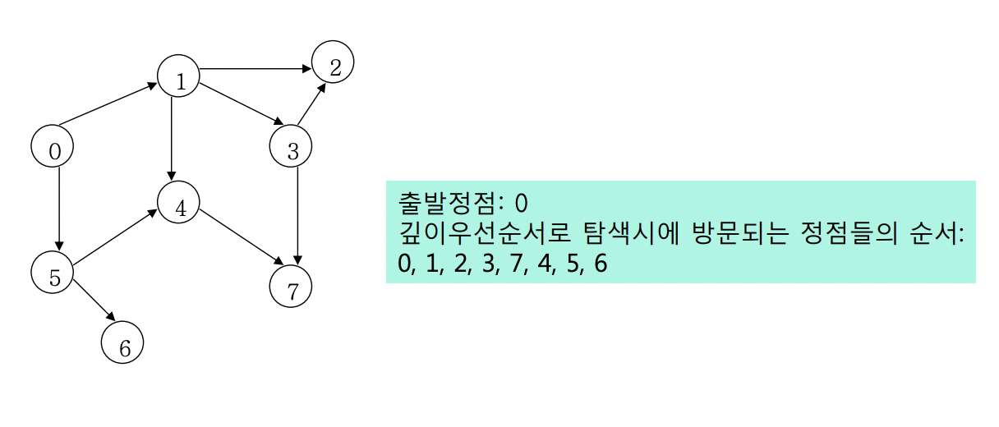
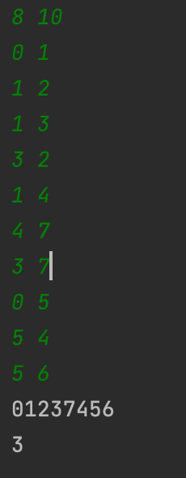
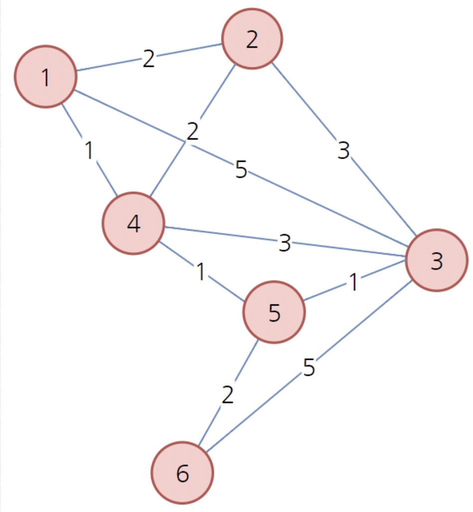

## **Algorithm**

---

- [**Algorithm**](#algorithm)
  - [**DFS(깊이 우선 탐색)**](#dfs깊이-우선-탐색)
    - [**DFS 동작 원리**](#dfs-동작-원리)
    - [**DFS 시간 복잡도**](#dfs-시간-복잡도)
    - [**DFS 코드 구현**](#dfs-코드-구현)
  - [**BFS(너비 우선 탐색)**](#bfs너비-우선-탐색)
    - [**BFS 동작 원리**](#bfs-동작-원리)
    - [**BFS 시간 복잡도**](#bfs-시간-복잡도)
    - [**BFS 코드 구현**](#bfs-코드-구현)
  - [**다익스트라(dijkstra)**](#다익스트라dijkstra)
    - [**다익스트라(dijkstra) 시간 복잡도**](#다익스트라dijkstra-시간-복잡도)
    - [**Priority Queue로 다익스트라 구현**](#priority-queue로-다익스트라-구현)

</br>
</br>
</br>

### **DFS(깊이 우선 탐색)**

---

</br>

- 그래프를 `깊이`, 종의 방향 각 정점을 한 번만 방문하는 완전 탐색.
- `재귀`, `stack` 구현 방식
- 재귀 호출 시 스택 메모리에 쌓임, 이론 상 동일한 원리

</br>

#### **DFS 동작 원리**

</br>

> 1. 시작 정점 시작.
> 2. 현재 방문 정점 v와 인접한 정점을 하나씩 검사.
> 3. 방문 되지 않은 정점 w가 있으면 방문 반복 후
> 4. 더 이상 갈 곳이 없는 정점에 도달하면 이전 간선을 따라 backtrack
> 5. 다시 인접한 정점을 방문 탐색 반복

</br>
</br>

#### **DFS 시간 복잡도**

|  구현 방식  | 수행 시간 |
| :---------: | :-------: |
|  인접 행렬  |  O(n^n)   |
| 인접 리스트 |  O(n+m)   |

- n : 정점의 개수
- m : 에지의 개수

1. 인접 행렬

> 인접 하는 간선을 모두 검사하는 방식으로 2차원 행렬을 통해 에지 정보를 모두 검색함으로 O(n^n)이다.

</br>

1. 인접 리스트

> 각 정점 n개의 리스트가 가지고 있는 m의 정보임으로 O(n+m)이다.

</br>
</br>

#### **DFS 코드 구현**



> 예시 그림대로 0에서 부터 출발 하여 각각 인접행렬과 인접리스트로 구현 후  
> 시작 지점과 도착 지점 간의 최소 거리를 출력 해보기.

</br>

- 인접 행렬

</br>

```java
public static void dfsByMatrix(int adjMatrix[][], boolean[] visited, int start, int end,int distance){
        //인접행렬 구현
        visited[start] = true;
        path += start;


        if(start == end){ // 탐색 성공
            if(shortestDistance == -1) // 첫 번째 탐색일 경우 갱신
                shortestDistance = distance;
            else
                /* 첫 번째 탐색이 아닐 경우
                 * 1) 현재 최단 거리가 distance보다 크면 최단 거리 갱신
                 * 2) 현재 최단 거리가 distance보다 작으면 현재 최단 거리 유지.
                 */
                shortestDistance = shortestDistance > distance ? distance : shortestDistance;
            return;

        }


        for(int w = 0; w<adjMatrix.length; w++){
            if(adjMatrix[start][w] == 1 && !visited[w]){
                dfsByMatrix(adjMatrix,visited,w,end,distance+1);
            }
        }
        return; // 탐색 불가
    }
```

</br>

- 인접 리스트

```java
public static void dfsByList(ArrayList<Integer>[] arrayLists, boolean[] visited, int start, int end, int distance){
        //인접 리스트 구현
        visited[start] = true;
        path+=start;

        if(start == end){ // 탐색 성공
            if(shortestDistance == -1) // 첫 번째 탐색일 경우 갱신
                shortestDistance = distance;
            else
                /* 첫 번째 탐색이 아닐 경우
                 * 1) 현재 최단 거리가 distance보다 크면 최단 거리 갱신
                 * 2) 현재 최단 거리가 distance보다 작으면 현재 최단 거리 유지.
                 */
                shortestDistance = shortestDistance > distance ? distance : shortestDistance;
            return;
        }

        for (int w : arrayLists[start]) {
            if(!visited[w])
                dfsByList(arrayLists, visited, w, end, distance+1);
        }

        return; //탐색 불가
    }
```

> - 두 방식 모두 재귀를 통해 구현 했기 때문에 항상 탈출 조건에 유의.

</br>
</br>
</br>

- 전체 코드 및 테스트

```java

import java.util.ArrayList;
import java.util.Scanner;

/*input example
* n m (8, 10)
* 0 1
* 1 2
* 1 3
* 3 2
* 1 4
* 4 7
* 3 7
* 0 5
* 5 4
* 5 6
* */

public class DFS {
    private static int shortestDistance=-1; // 탐색 불가.
    private static String path ="";

    public static void main(String[] args) {
        Scanner sc = new Scanner(System.in);

        int n = sc.nextInt(); // 정점의 개수
        int m = sc.nextInt(); // 에지의 개수

        int[][] adjMatrix = new int[n][n];// 인접행렬 0으로 초기화
        ArrayList<Integer>[] adjList = (ArrayList<Integer>[])new ArrayList[n];
        for (int i = 0; i < n; i++) {
            adjList[i] = new ArrayList<>();
        }

        for (int i = 0; i < m; i++) {
            int v1 = sc.nextInt();
            int v2 = sc.nextInt();

            adjMatrix[v1][v2] = 1;
//in case of undirected graph adjMatrix[v2][v1] = 1;
            adjList[v1].add(v2);
//in case of undirected graph list[v2].add(v1);
        }

        boolean[] visited = new boolean[n];

        for (int i = 0; i < n; i++) {
            visited[i] = false; // 미방문 초기화
        }

        dfsByList(adjList,visited,0,7,0);
        System.out.println(path);
        System.out.println(shortestDistance);
    }

    public static void dfsByMatrix(int adjMatrix[][], boolean[] visited, int start, int end,int distance){
        //인접행렬 구현
        visited[start] = true;
        path += start;


        if(start == end){ // 탐색 성공
            if(shortestDistance == -1) // 첫 번째 탐색일 경우 갱신
                shortestDistance = distance;
            else
                /* 첫 번째 탐색이 아닐 경우
                 * 1) 현재 최단 거리가 distance보다 크면 최단 거리 갱신
                 * 2) 현재 최단 거리가 distance보다 작으면 현재 최단 거리 유지.
                 */
                shortestDistance = shortestDistance > distance ? distance : shortestDistance;
            return;

        }


        for(int w = 0; w<adjMatrix.length; w++){
            if(adjMatrix[start][w] == 1 && !visited[w]){
                dfsByMatrix(adjMatrix,visited,w,end,distance+1);
            }
        }
        return; // 탐색 불가
    }

    public static void dfsByList(ArrayList<Integer>[] arrayLists, boolean[] visited, int start, int end, int distance){
        //인접 리스트 구현
        visited[start] = true;
        path+=start;

        if(start == end){ // 탐색 성공
            if(shortestDistance == -1) // 첫 번째 탐색일 경우 갱신
                shortestDistance = distance;
            else
                /* 첫 번째 탐색이 아닐 경우
                 * 1) 현재 최단 거리가 distance보다 크면 최단 거리 갱신
                 * 2) 현재 최단 거리가 distance보다 작으면 현재 최단 거리 유지.
                 */
                shortestDistance = shortestDistance > distance ? distance : shortestDistance;
            return;
        }

        for (int w : arrayLists[start]) {
            if(!visited[w])
                dfsByList(arrayLists, visited, w, end, distance+1);
        }

        return; //탐색 불가
    }
}
```



예시 이미지와 동일한 정보를 입력.
시작 노드는 0, 도착 노드는 7로 테스트 한 결과

[To 목차](#algorithm)

</br>
</br>
</br>

### **BFS(너비 우선 탐색)**

---

</br>

- 그래프를 `너비`, `횡의 방향`으로 각 정점을 한 번씩만 방문하는 완전 탐색
- `큐` 구현 방식

[To 목차](#algorithm)

#### **BFS 동작 원리**

- 시작 지점으로 부터 거리(깊이)가 증가하는 순서 대로 방문

#### **BFS 시간 복잡도**

|  구현 방식  | 수행 시간 |
| :---------: | :-------: |
|  인접 행렬  |  O(n^n)   |
| 인접 리스트 |  O(n+m)   |

- n : 정점의 개수
- m : 에지의 개수

</br>

1. 인접 행렬

> 인접 하는 간선을 모두 검사하는 방식으로 2차원 행렬을 통해 에지 정보를 모두 검색함으로 O(n^n)이다.

</br>

2. 인접 리스트

> 각 정점 n개의 리스트가 가지고 있는 m의 정보임으로 O(n+m)이다.

#### **BFS 코드 구현**


> 예시 그림에서 시작 지점 0으로부터 7 탐색하기.

- 인접리스트와 큐로 구현

```java
/*
*  8 9
*  0 1
*  1 2
*  1 3
*  1 4
*  3 7
*  0 5
*  5 4
*  5 6
*  4 7
*
* */

public class BFS {
    private static int shortestDistance=-1; // 탐색 불가.
    private static String path ="";

    public static void main(String[] args) {

        Scanner sc = new Scanner(System.in);

        int n = sc.nextInt(); // 정점의 개수
        int m = sc.nextInt(); // 에지의 개수

        ArrayList<Integer>[] adjList = (ArrayList<Integer>[])new ArrayList[n];
        for (int i = 0; i < n; i++) {
            adjList[i] = new ArrayList<>();
        }

        for (int i = 0; i < m; i++) {
            int v1 = sc.nextInt();
            int v2 = sc.nextInt();

            adjList[v1].add(v2);
            adjList[v2].add(v1);
        }

        bfsByList(adjList,0,3);

        System.out.println(path);
        System.out.println(shortestDistance);
    }

    public static void bfsByList(ArrayList<Integer>[] adjList, int start, int end) {
        int[] distance = new int[adjList.length]; // 지점 별 거리 저장

        boolean visited[] = new boolean[adjList.length];
        Queue<Integer> queue = new LinkedList<>();

        visited[start] = true;
        queue.add(start);

        while(!queue.isEmpty()){
            start = queue.poll();
            path+=start; // 경로 추가
            if(start == end) { // 도착하면
                shortestDistance = distance[start];
                break;
            }


            for(int i=0;i<adjList[start].size();i++){
                int w= adjList[start].get(i);
                if(!visited[w]){
                    visited[w] = true;
                    distance[w] = distance[start]+1; // 이전 지점 거리 + 1
                    queue.add(w);
                }

            }
        }

        queue.clear();
        return;
    }


}
```

</br>
</br>

[To 목차](#algorithm)

</br>
</br>
</br>

### **다익스트라(dijkstra)**

</br>

> - 최소 비용은 여러개의 최소 비용으로 구성된다는 DP
> - 하나의 최소 비용을 구할 때 이전의 구한 최단 거리 정보를 사용하여 갱신.

</br>

#### **다익스트라(dijkstra) 시간 복잡도**

| 자료구조 | 시간복잡도 |
| :------: | :--------: |
|   선형   |   O(N^2)   |
|   Heap   | N\*O(logN) |

</br>

#### **Priority Queue로 다익스트라 구현**

</br>

- reference
  - [동빈나 다익스트라 알고리즘](https://blog.naver.com/ndb796/221234424646)



</br>

> - startNode 1로 세팅
> - startNode에서 인접한 노드 비용 설정 후 방문 하지 않은 최소 비용 노드 방문
> - 최소 비용 계속 세팅
> - 인접하지 않은 노드 infinity(Integer.MAX_VALUE)

</br>

- ! 각 비용을 모두 출력하고, 비용이 (`k=3`) 이하인(자신 제외) 노드 개수(`count`) 출력. ([Programmers level2 배달 문제](https://programmers.co.kr/learn/courses/30/lessons/12978?language=java) 유사)

```java
package com.cs.algorithm;

import java.util.ArrayList;
import java.util.Arrays;
import java.util.PriorityQueue;

public class Dijkstra {

    public static class Node implements Comparable<Node> {
        int num;
        int cost;

        Node(int num, int cost) {
            this.num = num;
            this.cost = cost;
        }

        // 최소 비용이 우선순위로
        @Override
        public int compareTo(Node node) {
            return this.cost < node.cost ? -1 : 1;
        }
    }

    public static void main(String[] args) {

        // edge data from - to - cost
        int edge[][] = {
                {1, 2, 2},
                {1, 3, 5},
                {1, 4, 1},
                {2, 3, 3},
                {2, 4, 2},
                {3, 4, 3},
                {3, 5, 1},
                {3, 6, 5},
                {4, 5, 1},
                {5, 6, 2}
        };

        // n : node 개수
        // k : k 이하 cost
        // count : 자신을 제외한 k 이하 cost 개수
        int n = 6;
        int k = 3;
        int count = 0;

        int[] costArr = new int[n + 1];
        Arrays.fill(costArr, Integer.MAX_VALUE); // Infinity로 설정.

        //edge data를 인접리스트로 설정
        ArrayList<Node>[] adjList = new ArrayList[n + 1];
        for (int i = 1; i <= n; i++)
            adjList[i] = new ArrayList<>();

        for (int i = 0; i < edge.length; i++) {
            int from = edge[i][0];
            int to = edge[i][1];
            int cost = edge[i][2];

            adjList[from].add(new Node(to, cost));
            adjList[to].add(new Node(from, cost));
        }

        PriorityQueue<Node> pq = new PriorityQueue<>();

        // 시작 노드 설정
        int start = 1;
        costArr[start] = 0;
        pq.add(new Node(1, 0));

        // 다익스트라 알고리즘으로 start로부터 각 노드 최소 비용 갱신
        while (!pq.isEmpty()) {
            Node node = pq.poll();
            int currentNum = node.num;
            int currentCost = node.cost;

            // 최소비용 아니면 continue;
            if (costArr[currentNum] < currentCost)
                continue;

            for (int i = 0; i < adjList[currentNum].size(); i++) {

                // 다음 노드 정보 세팅
                int nextNum = adjList[currentNum].get(i).num;
                int nextCost = adjList[currentNum].get(i).cost + currentCost;

                // 최소비용 계산
                if (costArr[nextNum] > nextCost) {
                    costArr[nextNum] = nextCost;
                    pq.add(new Node(nextNum, nextCost));
                }
            }
        }

        // cost 출력 및 k이하 검색.
        for(int i=1;i<=n;i++){
            /*
            Node 1 cost : 0
            Node 2 cost : 2
            Node 3 cost : 3
            Node 4 cost : 1
            Node 5 cost : 2
            Node 6 cost : 4
            출력
            */
            System.out.println("Node " + i + " cost : " + costArr[i]);
            if(costArr[i] <=k)
                count++;
        }

        System.out.println();
        count-=1; // 자기 자신 제외


        // 4 출력
        System.out.println(count);
    }

}

```

</br>
</br>

[To 목차](#algorithm)

</br>
</br>
</br>
