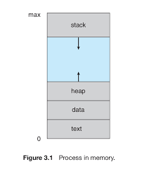

- [Reference-inflearn](https://www.inflearn.com/course/%EC%9A%B4%EC%98%81%EC%B2%B4%EC%A0%9C-%EA%B3%B5%EB%A3%A1%EC%B1%85-%EC%A0%84%EA%B3%B5%EA%B0%95%EC%9D%98/lecture/63027?tab=note&volume=1.00&speed=2)

- Operating System, 저자 : Abraham Silberschatz , Peter Baer Galvin , Greg Gagne

</br>

## **My Goal**

---

</br>

- OS 공부
- 시간 절약 위해 강의로 하루에 수업 하나씩 듣고 필요한 부분 꼭 정리하기
- 배운 OS 지식들 명확하게 답변할 수 있도록 하기.

</br>
</br>
</br>

## **Table of Contents**

---

- [**My Goal**](#my-goal)
- [**Table of Contents**](#table-of-contents)
  - [**ch1-2. Introduction & O/S structures**](#ch1-2-introduction--os-structures)
  - [**ch3. Processes**](#ch3-processes)
    - [**프로세스 concept**](#프로세스-concept)
    - [**프로세스 life cycle**](#프로세스-life-cycle)
    - [**PCB**](#pcb)
    - [**Context Switch**](#context-switch)
    - [**zombie 프로세스와 orphan 프로세스의 차이**](#zombie-프로세스와-orphan-프로세스의-차이)
    - [**fork() wait()**](#fork-wait)
    - [**IPC**](#ipc)
  - [**ch4. Thread**](#ch4-thread)
    - [**thread 특징**](#thread-특징)
    - [**ch5. Scheduling**](#ch5-scheduling)
    - [**스케줄링의 척도**](#스케줄링의-척도)
    - [**FCFS**](#fcfs)
    - [**SJF**](#sjf)
    - [**SRTF**](#srtf)
    - [**RR**](#rr)
    - [**Priority-based**](#priority-based)
    - [**MLQ**](#mlq)
    - [**MLFQ**](#mlfq)
  - [**ch6. Synchronization Tools**](#ch6-synchronization-tools)
    - [**Race Condition**](#race-condition)
    - [**Race Condition 해결 충족 조건**](#race-condition-해결-충족-조건)
    - [**Mutex**](#mutex)
    - [**sSemaphore**](#ssemaphore)

</br>

### **ch1-2. Introduction & O/S structures**

</br>

- OS

> - 컴퓨터 시스템을 운영하는 소프트웨어
> - 컴퓨터에서 항상 실행되는 프로그램
> - `시스템 서비스를 애플리케이션에 지원하는 소프트 웨어`
> - `프로세스`, 자원, 유저 인터페이스 관리

</br>

- Program

> - `컴퓨터가 수행할 명령어들의 집합`

</br>

- 인터럽트

</br>

> 시스템 버스를 통해 처리가 필요한 경우 cpu로 신호를 전달하여 하드웨어가 처리할 수 있도록 하는것

</br>

- 멀티 프로그래밍

</br>

> CPU 사용률을 증가 시킬 수 있도록 메모리에 동시에 여러 프로세스를 로드하는 것

</br>

- 멀티 프로세싱

</br>

> 다수의 작업을 운영체제의 스케줄링에 의해 동시에 수행되도록 하는 것

</br>

- Operating System operations

</br>

> - usermode와 kernel mode로 나뉨
> - 유저에서 프로세스가 실행 되고, 시스템 콜을 호출
> - 커널은 시스템콜을 실행하고 유저에게 시스템 콜 정보를 반환
> - 프로그램을 악의적인 액션에 대해 보호하기 위해 나눈 구조

</br>
</br>
</br>

### **ch3. Processes**

</br>

> 하나의 실행되는 프로그램으로 os에서 작업의 단위

</br>

- 프로세스가 필요한 자원들
  - CPU Time
  - memory
  - files
  - I/O devices

</br>

#### **프로세스 concept**

</br>

|               process - memory                |
| :-------------------------------------------: |
|  |

</br>

| segment |                  description                  |
| :-----: | :-------------------------------------------: |
|  text   |             실행되는 명령어 코드              |
|  data   |            전역 변수, 배열, 구조체            |
|  heap   |  run time에서 동적으로 할당되는 메모리 공간   |
|  stack  | 함수 호출 시 생성 되고, 종료시 반환 되는 영역 |

> `data 영역`은 initialized와 uninitialized가 있다.  
> runtime 이후에 결정되는 uninitialized가 메모리 관점에서 효율적
>
> `stack`만 메모리의 상위 영역부터 할당되는 segment

</br>

#### **프로세스 life cycle**

</br>

|               process life cycle                |
| :---------------------------------------------: |
|  |

</br>

> - 프로세스가 생성되고 `ready queue`에 들어감
> - scheduler dispatch로 `running` 상태
> - 실행중인 프로세스는
>   - IO나 event 발생 시 `wating queue`로
>   - interrupt 발생 시 `ready queue`로 이동
> - running 상태에서 exit이나 프로세스를 반환하면 종료

#### **PCB**

</br>

|             data              |                      description                      |
| :---------------------------: | :---------------------------------------------------: |
|              PID              |                    프로세스 식별자                    |
|         Process state         |               프로세스 cycle 중에 상태                |
|              PC               |       현재 프로세스가 실행할 다음 명령어의 주소       |
|         CPU registers         |                        DR, IR                         |
| Memory-mangaement information |                                                       |
|    Acoounting information     |       페이지 테이블, 스케줄링 큐 포인터 부모 등       |
|          I/O status           | 프로세스에 할당된 입출력 장치 목록, 열린 파일 목록 등 |

</br>

#### **Context Switch**

</br>

> 현재 프로세스에서 인터럽트가 발생할 경우  
> 시스템이 현재 프로세스의 컨텍스트를 저장하고,
> 실행되어야할 프로세스의 컨텍스트를 재개하는 것

</br>

#### **zombie 프로세스와 orphan 프로세스의 차이**

> - zombie 프로세스는 부모 프로세스가 wait() call을 하지 않았을때 자식 프로세스가 종료 되는것
>
>   - 2022.03.04 기준 -> 다음날 내용 추가
>
> - orphan 프로세스는 부모 프로세스가 wait() call을 하지 않아 자식 프로세스가 먼저 종료 되는 경우
>   - 이때 init 프로세스가 호출되어 자식 프로세스가 새로운 부모 프로세스가 됨

#### **fork() wait()**

- fork()

  > - 새로운 프로세스를 생성시키고 이 프로세스는 parent 프로세스의 주소공간을 복사
  > - 즉 서로 다른 스택, 힙, 데이터, 코드 영역을 가진다.

</br>

- wait()

  - wait() 함수 발생시 현재 프로세스는 wait queue로 이동
  - 자식 프로세스가 종료되 면 부모 프로세스는 ready queue로 이동
  - 다시 실행 가능

- 예제

```c
#include <stdio.h>
#include <unistd.h>
#include <wait.h>

int value = 5;

int main()
{
  pid_t pid;
  pid = fork();

  if(pid == 0){ // child
    value +=15;
    return 0;
  }
  else if(pid > 0){ // parent
    wait(NULL);
    printf("Parent: value = %d\n", value); // value=?
  }

}

```

</br>

> process는 서로 공유하는 data 영역이 다름  
> 즉 자식의 value와 parent의 value는 다른 영역임으로
> value = 5 !

</br>

#### **IPC**

</br>

> 프로세스가 서로 협력하며 실행 될 경우  
> 각 프로세스들간의 영향을 미치는 것(shared data)을 고려하는 `프로세스들간의 통신`

</br>

- shared memory

> 프로세스의 메모리 영역은 다른 프로세스가 접근 할 수 없도록 독립적인 공간을 보장해야 한다.  
> 따라서 각 프로세스들이 메모리 영역의 공유 메모리를 이용하여 사용 할 수 있도록 한다.  
> 커널은 프로세스로부터 공유메모리 할당 요청을 받은 이후, 프로세스들이 해당 공유 메모리 영역에 접근 할 수 있다.

</br>

- message passing

> 공유하는 메모리 영역 없이 프로세스 사이에 데이터를 송수신 및 동기화 작업
> OS는 send()와 receive 명령어를 제공
> link를 구성할 때 direct or indirect 또 동기화와 비동기 통신 설정

|            수단            |                                설명                                |
| :------------------------: | :----------------------------------------------------------------: |
|           direct           | 송수신자를 명시하여 하나의 링크를 제공하여 두 개의 프로세스가 소통 |
|          indirect          |      mailbox(port)를 이용하여 두 개 이상의 프로세스들이 소통       |
|   synchronous(blocking)    |  sender(receiver) 보냈다(받았다)는 메시지를 받기 전까지 blocking   |
| asynchronous(non-blocking) |      sender(receiver)가 송수신하고 계속하여 다른 작업을 수행       |

</br>

> 영화 2g를 mailbox(1G)를 통해 송수신한다고 가정
> sender가 2g를 다 보내어 메시지를 받기 전까지 sender blocking, > receiver도 다 받았다는 메시지 받기 전까지 blocking
>
> sender가 2g를 다 보냈다는 메시지 받지 않아도 running 상태
> receiver 역시 메시지 여부 필요 없음

- Pipe

|        Ordinary pipe         |                 named pipe                  |
| :--------------------------: | :-----------------------------------------: |
| 부모 자식 관계에서 연결 가능 | 통신할 프로세스들을 모를 경우에도 연결 가능 |

> 두 pipe 방식다 한 쪽에서 쓰고, 한쪽에서 사용하는 단순한 흐름일 때 간편
> two - way 전이중 통신에서는 pipe를 2개 만들어 구현을 복잡하게 한다.

</br>

- Socket

> 전송을 주고 받을 프로세스들간의 ip와 port를 바인딩하여 데이터 공유

</br>

```java

import java.net.*;
import java.io.*;

public class DateServer {

    public static void main(String[] args) throws Exception{

    ServerSocket server = new ServerSocket(6013);

    /* Now listen for connections */
    while (true) {
      Socket client = server.accept();
      PrintWriter pout = new PrintWriter(client.getOutputStream(), true);

      /* write the Date to the socket */
      pout.println(new java.util.Date().toString());

      /* close the socket and resume listening for connections */
      client.close();
    }
  }
}

```

```java

 import java.net.*;
  import java.io.*;
  public class DateClient {

      public static void main(String[] args) throws Exception {

          /* make connection to server socket */
          Socket socket = new Socket("127.0.0.1", 6013);
          InputStream in = socket.getInputStream();
          BufferedReader br = new BufferedReader(new InputStreamReader(in));

          /* read date from the socket */
          String line = null;
          while ((line = br.readLine()) != null)
              System.out.println(line);

          /* close the socket connections */
          socket.close();
      }
}

```

> 서버는 소켓을 열고 클라이언트 소켓 연결 대기 - server.accept()  
> 서버는 클라이언트가 소켓 연결하면 client를 반환 받은 후 client outputStream에 데이터 입력  
> 서버는 클라이언트에게 전송 해준 후 client.close()
>
> 클라이언트는 ip와 port로 서버 바인딩
> 클라이언트는 inputStream으로 데이터를 받아온 후 client 종료.

</br>
</br>
</br>

### **ch4. Thread**

</br>

> 프로세스에서 하나의 실행 단위

</br>

#### **thread 특징**

> 하나의 스레스가 동기 실행하더라도 다른 스레드는 실행을 계속할 수 있어 `반응성` 좋다
> code, data, heap을 공유하여 `자원을 공유`하는데 용이하다.
> process 사이의 context switching보다 경제적이다.

</br>
</br>
</br>

#### **ch5. Scheduling**

</br>

> CPU 이용률을 최대화 하기 위해 우선순위를 정하여 레디큐에서 프로세스를 꺼내오는 순서 정하기

</br>

- 선점(preemtive)

> CPU가 스케줄러에 의해 프로세스를 선점 할 수 있는 경우

</br>

- 비선점(non-preemtive)

> 프로세스가 CPU를 반환하기 전까지 CPU 사용을 유지하는 경우

</br>

- dispatcher

> CPU의 제어를 주는 모듈로, context switch를 실행  
> 즉 잦은 context switch는 dispatcher 지연을 발생 시켜 오버헤드 발생 가능성

</br>

#### **스케줄링의 척도**

> - Throughput : 단위 시간당 처리되는 프로세스들의 수(작업량)
> - Turnaround Time : 프로세스의 수행 시간(start ~ end)
> - Waiting Time : 프로세스가 ready queue에서 대기하는 시간
> - Response Time : 작업이 실행 되기까지의 시간

</br>

#### **FCFS**

</br>

> 말 그대로 먼저 온게 먼저 나간다.  
> but, CPU burst time이 긴 프로세스가 들어올 경우 평균 대기시간이 증가함(convoy effect)

</br>

#### **SJF**

</br>

> CPU burst가 짧은 프로세스 순으로 실행  
> but, 다음에 들어올 CPU burst의 예측이 지수 평균 근사치로 계산하기 때문에 예측 어려움

</br>

#### **SRTF**

</br>

> 프로세스가 진행 중일때 새로운 프로세스가 들어올 경우 더 짧은 시간이 남아있는 프로세스를 선점하는 스케줄링  
> 이것 역시 이론상 효율적이지만 잦은 context switching으로 오버헤드 높아짐

</br>

#### **RR**

</br>

> 일정 타임퀀텀을 두고 스케줄링하는 기법  
> 타임퀀텀이 너무 짧을 경우 잦은 context switching  
> 너무 길 경우 FCFS와 근사해지는 문제점

</br>

#### **Priority-based**

</br>

> 우선순위 순으로 실행되는 스케줄링 기법  
> 단 우선순위가 낮은 프로세스에서 starvation 현상 발생  
> 대기하는 프로세스의 우선순위를 증가시키는 aging으로 문제 해결

</br>

#### **MLQ**

</br>

> 작업들을 그룹화 하여 각 그룹의 우선순위를 지정한 후 그룹별로 큐를 사용하는 방식

</br>

#### **MLFQ**

</br>

> 타임퀀텀을 상이한 RR queue를 두고  
> 타임퀀텀을 다 소비하고도 종료되지 않으면 점진적으로  
> 더 타임퀀텀이 긴 RR queue로 이동하여 수행되도록 하는 것

</br>
</br>
</br>

### **ch6. Synchronization Tools**

</br>

#### **Race Condition**

</br>

> 여러개의 프로세스들이 critical section 영역에 접근 할때 데이터 불일치가 발생  
> entry section에서 프로세스의 진입을 허가 받고
> critical section을 사용하고
> exit section에서 허가를 반납

#### **Race Condition 해결 충족 조건**

> `Mutual Exclusion(상호 배제)` : 프로세스가 critical section 점유 상태면 다른 프로세스는 접근 불가  
> `Progress(진행 - avoid DeadLock)` : 다른 프로세스가 critical section에 들어가는 것을 방해하면 안된다.  
> `Bounded Waiting(한정 대기 - avoid Starvation)` : 기다리는 시간의 제한을 정하여 무한정 대기를 피한다.

</br>
</br>
</br>

#### **Mutex**

> mutex는 임계구역을 보호하고 레이스컨디션을 방지하기 위함  
> 프로세스가 락을 획득하여 임계 구역에 들어가고 나올 때 락을 반환

</br>

- busy waiting

> 프로세스가 임계구역에 들어가려고 할 때 무한 loop로 lock을 대기 할 때 발생  
> 장점 : 공유자원을 사용하는 프로세스들의 자원 사용 시간이 짧으면 효율적  
> 단점 : 권한 획득을 위해 CPU 낭비 발생

#### **sSemaphore**

> n개의 프로세스가 크리티컬 섹션을 동시 접근 할때 문제 발생 방지  
> mutex가 boolean 값으로 체크하는 반면 세마포어는 자원의 개수로 결정  
> 0과 1(binary semaphore)일때 mutex lock과 유사  
> 세마포어에서 busywaiting 문제를 해결하기 위해 wait() 함수 사용  
> wait()함수를 통해 현재 프로세스를 중지 하고 wait queue로 보낸 후  
> siganl() 통해 재시작 하는 메커니즘
